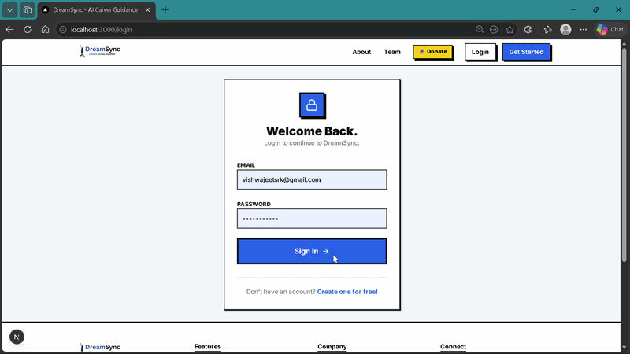

# 🌙 DreamSync AI — Precision-Engineered Career & Wellness

> **The all-in-one AI ecosystem for career growth and mental well-being.**
> Precision-built for the high-depth Indian job market with a premium **Neo-Brutalist** aesthetic.

### 🛡 AI Safety & Security Architecture (v21.4)
The DreamSync platform now features a centralized **Global AI Guard** layer, making it one of the most secure and professional career platforms on the market.

*   **Centralized Validation (`/lib/aiGuard.ts`)**: Every user input across all AI modules (Roadmap, Portfolio, IKIGAI, ATS, Career Agent) is first scanned by our fuzzy-logic guard for harmful, illegal, or unethical intent.
*   **API Level Hardening**: Strict validation sits at the gateway of every API route, immediately blocking (HTTP 400) requests involving violence, cybercrime, or dangerous activities.
*   **Safety Mandate Injection**: All system prompts are injected with a 2026-standard Safety Mandate, ensuring AI models proactively refuse unethical requests even if they bypass keyword filters.
*   **Professional Fallback System**: Users attempting to explore unsafe paths are gracefully redirected toward professional alternatives (e.g., Software Engineering or Cybersecurity Analyst) via an industrial-grade error handling UI.

---

### 📂 Repository Structure & Mirroring
DreamSync utilizes a dual-repository structure for development and production synchronization:

1.  **Primary Development (`DreamSync`)**: The official source of truth. All feature work and safety updates reside here.
    *   [https://github.com/Vishwajeetsrk/DreamSync](https://github.com/Vishwajeetsrk/DreamSync)
2.  **Production Mirror (`dreamssync`)**: The production-ready stable build, synchronized for Vercel deployment and scaling.
    *   [https://github.com/Vishwajeetsrk/dreamssync](https://github.com/Vishwajeetsrk/dreamssync)

---

- **Live Deployment:** [dreamsync.vercel.app](https://dreamsync-ruddy.vercel.app/)

## 🎥 Live Portfolio Preview (Auto-Play)

<p align="center">
  
</p>

<p align="center">
  <a href="./video.mp4">
    
  </a>
</p>

> ▶️ **GIF auto-plays** on GitHub  
---

## 🎨 Visual Language: Neo-Brutalism

DreamSync features a custom-engineered **Neo-Brutalist** design system designed to be high-contrast, high-impact, and tactile:
- **Official Branding**: Utilizing the **DreamSynclogo.png** for a consistent, high-fidelity identity across the web and documents.
- **Hard-Surface Shadows**: Real-time 4px/6px/8px black offsets for a physical depth feel on all cards and buttons.
- **Bold Typography**: Inter & Black-weights (900+) for maximum legibility and industrial impact.
- **Vibrant Accent Palette**: Action-oriented colors (Yellow #fcc419, Blue #3b82f6) on flat white/black surfaces.
- **Advanced Micro-Animations**: Powered by **Framer Motion** for a fluid, responsive interaction experience.

---

## 📋 Table of Contents

- [Overview](#-overview)
- [Features](#-features)
- [Tech Stack](#-tech-stack)
- [Project Structure](#-project-structure)
- [Getting Started](#-getting-started)
- [Environment Variables](#-environment-variables)
- [API Routes](#-api-routes)
- [Deployment](#-deployment)

---

## 🚀 Overview

DreamSync is a precision-engineered, full-stack AI platform built with **Next.js 16 (App Router)** and **React 19**. It leverages a robust backend powered by **Supabase**, **Upstash Redis**, and a multi-model AI architecture (OpenAI, Groq, Google Gemini, OpenRouter).

The platform bridges the gap between technical career excellence and personal well-being:
1.  **Technical Excellence:** AI-driven resume building, ATS scoring, and high-depth career roadmap architecture.
2.  **Career Guidance:** A dedicated **Career Agent** providing real-time Indian job market insights, salary benchmarks, and direct application links.

The UI follows a **Neo-Brutalism + Fintech** aesthetic, utilizing **Tailwind CSS v4** and **Framer Motion** for a premium, high-interaction experience.

---

## ✨ Features

| Feature | Description | Engine / Stack |
|:---|:---|:---|
| 🛡️ **Universal Access** | **Streamlined Account Creation** with professional identity management. | Firebase + @supabase/ssr |
| 👤 **Security Profile** | **Advanced Identity Management** including photo upload, secure settings, and credential control. | Firebase Storage + Firestore |
| 🛡️ **Identity Guard** | **Encrypted Multi-Device Data Persistence** ensuring your career documents are always secure. | Firestore + AES-256 |
| 🛡️ **Intelligent Guardrails** | **Platform-wide AI Safety Layer** engineered to prevent prompt injection and maintain ethical AI. | Custom Safety Layer |
| 🕉️ **IKIGAI Engine** | **High-Depth Career Purpose Analysis** utilizing the Japanese Ikigai framework. | Claude / Gemini |
| 🌿 **Serenity Counselor** | **Empathetic Mental Health Support** supporting **11 Indian languages** with Voice AI integration. | Groq / Google TTS |
| 🤖 **AI Career Strategist** | **2026 Market Intelligence Agent** providing real-time salary benchmarks and direct job links. | Groq / Redis |
| 🗺️ **Career Roadmap** | **High-Depth Architecture Generator** with curated phase-by-phase learning resources. | GPT-4o / GPT-4o-mini |
| 📚 **Doc & Skill** | **Step-by-step guides & free resources** for essential carrier documentation and skills. | Next.js RSC |
| 💼 **LinkedIn Optimizer** | **Advanced Profile Engineering** with actionable rewrite suggestions and SEO keywords. | OpenAI / Tailwind v4 |
| 🧠 **FAANG Resume Suite** | **Precision Document Engineering** supporting multi-format (PDF/Word) export. | React 19 / `docx` |
| 📊 **Smart ATS Analyzer** | **Recruiter-Grade Analysis** providing deep scoring against global hiring standards. | GPT-4o / Firestore |
| 🖼️ **Portfolio Engine** | **Instant Deployment** of professional portfolio sites generated dynamically. | Next.js RSC |

---

## 🛡️ Production-Grade Security

- 🚀 **Smart ATS Analyzer v2 (FAANG-Tier):** Industry-leading resume auditor with detailed eligibility reports for top firms (Google, Microsoft, Amazon).
- 🛡 **Global AI Safety Guard:** 400-level safety blocking enforced across all AI agents (Roadmap, Portfolio, IKIGAI, etc.).
- 👤 **Professional Identity Hub:** Redesigned minimalist profile & settings with circular avatars, system preferences (Language/Timezone), and secure credential management.
- 🗺 **AI Roadmap & Career Agent:** High-fidelity career paths and conversational guidance built on the Groq-powered 2026 engine.
- 🖼 **Next.js Remote Image Hardening:** Securely configured `remotePatterns` for Firebase Storage and Google Content to ensure asset visibility without security regressions.
- 4. **Edge Routing:** Next.js Middleware for pre-flight security checks.

---

## 📈 Performance & Optimization

- **Zero-Latency Sessions:** Global session caching utilizing **Upstash Redis** for near-instant user state retrieval.
- **Concurrent Rendering:** Fully optimized for **React 19**, leveraging concurrent features and progressive hydration.
- **Dynamic AI Fallbacks:** Engineered with a robust fallback system (OpenRouter → Gemini → GPT) to ensure 99.9% AI uptime.
- **Micro-Animation Engine:** High-performance UX animations powered by **Framer Motion** with GPU-accelerated transitions.

---

## 🛠 Tech Stack

### Frontend
- **Next.js 16** (App Router, Server Components)
- **React 19**
- **TypeScript 5**
- **Tailwind CSS v4**
- **Framer Motion** (Neo-Brutalist Animation Engine)

### Backend & Infrastructure
- **Firebase** (Global Client Auth, Storage & Profile Sync)
- **Supabase** (PostgreSQL & Server-Side Security)
- **Upstash Redis** (Global Rate Limiting & User Quota Tracking)
- **Resend** (High-Deliverability Email API)

### AI Engine
- **Groq** (`llama-3-8b/70b`) — *Ultra-fast inference for Serenity and Career Agent chat.*
- **OpenAI** (`gpt-4o`, `gpt-4o-mini`) — *Primary reasoning and resume engine.*
- **Google Gemini** (`gemini-2.0-flash`) — *Multimodal tasks and deep context analysis.*
- **OpenRouter** — *Dynamic model switching and unified API gateway.*

---

## 📁 Project Structure

```
dreamsync/
├── public/                         # Official DreamSynclogo.png and static assets
├── src/
├── app/
│   ├── (auth)/
│   │   ├── login/              # Secure login flow
│   │   ├── signup/             # Multi-step account creation
│   │   └── forgot-password/    # Enrollment recovery
│   │
│   ├── profile/                # Security Profile Settings (Photo + Security)
│   ├── mental-health/          # Serenity AI Counselor (11 languages + Mood + Voice)
│   ├── career-agent/           # AI Career Guidance (Indian Market Specs)
│   ├── roadmap/                # High-depth Career Roadmaps
│   ├── resume-builder/         # AI Resume Builder
│   ├── ats-check/              # ATS Score Checker
│   ├── linkedin/               # LinkedIn Profile Optimizer
│   ├── portfolio/              # Portfolio Generator
│   ├── documents/              # Doc & Skill storage
│   │
│   ├── dashboard/              # Centralized user dashboard
│   ├── donate/                 # UPI donation portal (Dynamic QR)
│   └── api/
│       ├── mental-health/      # Serenity chat endpoint (Groq/Gemini)
│       ├── career-agent/       # Career coach endpoint (Redis cached)
│       ├── roadmap/            # High-depth roadmap generation
│       └── usage/              # User quota tracking
│
├── components/
│   ├── MarketTrends.tsx        # Live 2026 job market data component
│   ├── ProtectedRoute.tsx      # Auth-guarded navigation
│   ├── Navbar.tsx              # Official header with refined logo
│   └── Footer.tsx              # Global footer with donate CTA
│
├── context/                    # Auth and User Usage contexts
└── lib/                        # Core AI logic, Firebase/Supabase, and API utils
```

---

## 🏁 Getting Started

### Prerequisites

- **Node.js** >= 20.x
- **npm** >= 10.x
- A **Supabase** instance (Project URL & Anon Key)
- A **Firebase** project (Client SDK config)
- An **Upstash Redis** URL/Token
- **API Keys:** OpenAI, Groq, or OpenRouter for AI features.

### Installation

```bash
# 1. Clone the repository
git clone https://github.com/Vishwajeetsrk/dreamssync.git
cd dreamssync

# 2. Install dependencies
npm install

# 3. Configure environment
cp .env.local.example .env.local
# Add your secret keys to .env.local

# 4. Start development server
npm run dev
```

Open [http://localhost:3000](http://localhost:3000) to see the application.

---

## 🚀 Deployment Checklist

When deploying to **Vercel** or a production server, ensure:

1.  **Firebase Authorized Domains**: Add your domain (e.g., `dreamsync.vercel.app`) to **Authorized domains** in the Firebase Console.
2.  **Environment Variables**: Match all keys from `.env.local` to your deployment secrets.
3.  **Whitelisting**: Ensure your deployment IP is whitelisted in Supabase/Redis settings if strict rules are active.

---

## 📄 License

© 2026 DreamSync AI. All rights reserved. Private repository.

---

*Built with ❤️ by [Vishwajeet](https://github.com/Vishwajeetsrk)*
